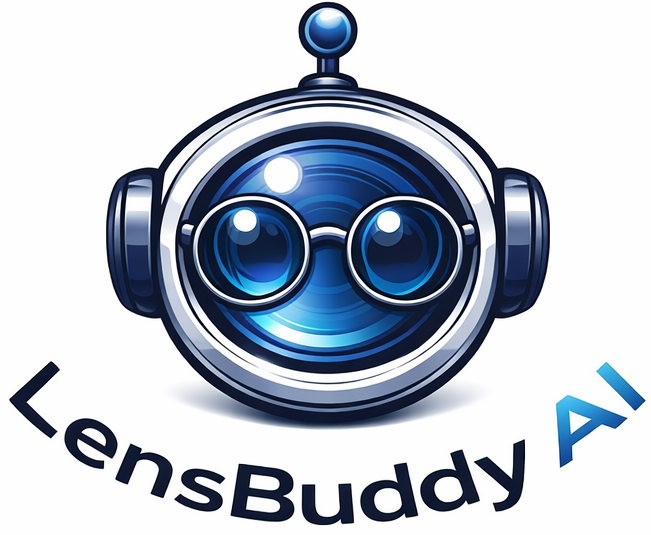

<p align="center">
  
</p>

# Lens Buddy AI

Lens Buddy AI is a multimodal desktop assistant built with Electron, JavaScript, and speech-to-text integration. It combines screenshot understanding, voice input, and mode-based prompting to deliver fast, structured help inside a lightweight desktop overlay.

## Overview

This project explores how AI can be integrated into a practical desktop workflow rather than a standard chat interface. Instead of relying on only typed prompts, the app works with:

- on-screen context through screenshots
- voice input through speech transcription
- mode-specific prompting for different tasks
- compact overlay-based interaction

The public repository is intended to showcase the application architecture, interface design, voice pipeline, and multimodal workflow. Users should provide their own local configuration for API-backed features.

## Features

- Screen-aware AI assistance through screenshot capture and analysis
- Voice-driven queries and transcript-based interaction
- Multiple working modes:
  - `Productivity`
  - `Explain`
  - `Coding`
  - `Meeting`
- `Fast` and `Deep` answer paths
- Compact desktop overlay UI
- Custom app branding and Windows executable packaging
- API routing and fallback support
- Vosk-based speech transcription pipeline

## Tech Stack

- Electron
- JavaScript
- HTML/CSS
- Node.js
- Vosk
- screenshot-desktop
- Google Generative AI SDK

## How It Works

1. The app captures visible screen content or receives a voice query.
2. Voice input is transcribed into text.
3. The selected mode shapes how the prompt is constructed.
4. Screenshot context and/or transcript context are sent to the AI service.
5. The response is shown inside a compact desktop overlay.

## Project Structure

```text
src/            Main Electron app logic, renderer UI, and IPC bridge
assets/         App assets and packaged icon files
icon.png        Project logo / branding image
vosk_live.py    Speech transcription helper
transcribe.py   Supporting transcription script
package.json    App configuration and build settings
```

## Local Setup

### Prerequisites

- Node.js
- Python 3
- pip packages:
  - `vosk`
  - `sounddevice`
  - `requests`

### Install

```powershell
npm install
```

Install Python dependencies:

```powershell
pip install vosk sounddevice requests
```

### Environment Setup

Copy `.env.example` to `.env` and fill in your own keys:

```env
GEMINI_API_KEY=
GEMINI_API_KEY_FREE=
GEMINI_API_KEY_PAID=
GEMINI_API_KEY_PAID_FALLBACK=
GEMINI_API_KEY_PAID_FALLBACK_2=
GEMINI_API_KEY_PAID_FALLBACK_3=
GEMINI_API_KEY_PAID_FALLBACK_4=
OPENROUTER_API_KEY=
```

Do not commit real API keys to the repository.

## Run the App

```powershell
npm start
```

## Build the Windows Executable

```powershell
npm run build -- --win portable
```

The portable build is generated in `dist/`.

## Notes for Public Use

- This repository should remain secret-free.
- Real API keys should stay only in local `.env`.
- Build output, local logs, and development artifacts should not be pushed to GitHub.

## Credits

This project was adapted and extended from the open-source base [Open-Cluely](https://github.com/shubhamshnd/Open-Cluely) by [shubhamshnd](https://github.com/shubhamshnd).

Additional work in this version includes:

- rebranding and packaging
- UI and interaction redesign
- screenshot and voice workflow changes
- mode-based prompting
- API routing and failover behavior
- desktop overlay refinements

## Disclaimer

This repository is presented as a desktop AI productivity and experimentation project. Users are responsible for configuring and using the software appropriately in their own environment.
